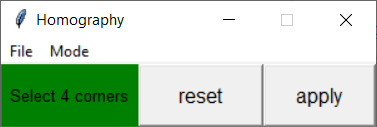
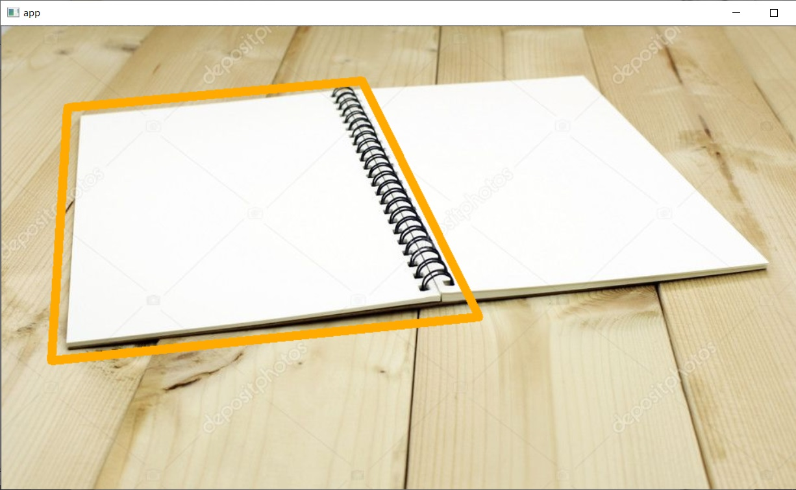

## HOMOGRAPHY APP

### Introduction

This application utilizes opencv, numpy and tkinter.

### Application interface.

* tkinter library
thin layer python UI to provide control on button

* opencv library
provides image file in/out read/write draw and display function

* numpy library
implement Calc homography for 4 points transformation
implement backward wrapping for image perspective transformation.
See homography.py

### Usage

1. Open UI 

```python
$ python app.py
```



#### SCANNER

2. Open image  

```
Select <File>
Select <Open>
Select <ImageFile>
```

3. Select Format of your scanner  

```
Select <Mode>
Select <Scanner>
Select <Fmt -> A4/F4/Card>
```



4. Select 4 points clockwisely within your images  

```
First with topleft
Reset the 4 points by Click <Reset> or right click the mouse
```

5. Click <Apply> Button  

```
Wait several seconds
Click <File>
Click <Save>
Write <Your File name>
```


### STITCH PANORAMA

2. Open image (Query image)

```
Select <File>
Select <Open>
Select <ImageFile>
```

example. foto1A.jpg

3. Open image (Train/Transform image)

```
Select <File>
Select <Open>
Select <ImageFile>
```

example. foto1B.jpg

4. Click <Apply> Button  

```
Wait several seconds
Click <File>
Click <Save>
Write <Your File name>
```


@author by tcyu@umich.edu

